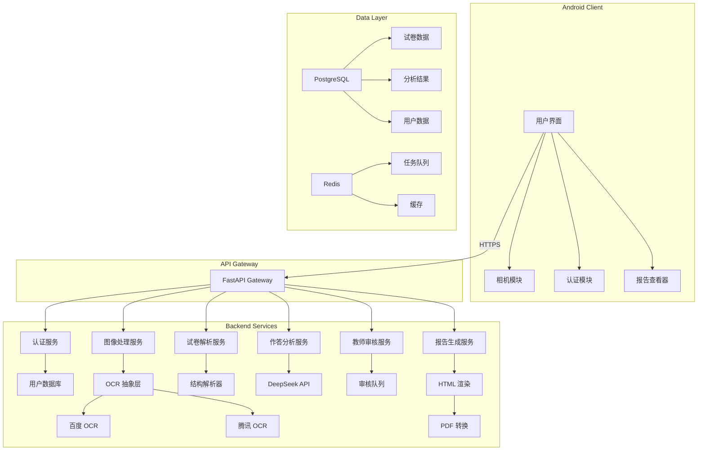

# Design Document: AI 试卷拍照测评工具

## Overview

AI 试卷拍照测评工具是一个端到端的教育测评系统，采用 Android 原生应用 + Python 后端的架构。系统通过 OCR、结构化解析、AI 诊断等技术栈，将学生上传的真实试卷照片转化为专业的 4 页测评报告。

核心设计理念：
- **证据驱动**：所有诊断结论必须有可追溯的证据支撑
- **人机协同**：AI 负责高效处理，教师负责关键判断
- **模块化**：清晰的模块边界，支持独立扩展和替换
- **商业化导向**：报告设计兼顾专业性和转化率

## Architecture

### System Architecture



### Technology Stack

**Android Client:**
- Language: Kotlin
- UI: Jetpack Compose
- Network: Retrofit + OkHttp
- Image: CameraX + Glide
- Storage: Room Database (local cache)

**Backend:**
- Framework: Python 3.11 + FastAPI
- OCR: Baidu OCR API / Tencent Cloud OCR
- AI: DeepSeek API
- Database: PostgreSQL 15
- Cache/Queue: Redis 7
- PDF: WeasyPrint / Playwright

**Infrastructure:**
- Deployment: Docker + Kubernetes
- Storage: Aliyun OSS
- Monitoring: Prometheus + Grafana


## Components and Interfaces

### 1. Authentication Service

**Responsibility:** 用户注册、登录、JWT token 管理

**API Endpoints:**
```python
POST /api/v1/auth/register
Request: {
    "phone": "13800138000",
    "verification_code": "123456",
    "password": "hashed_password"
}
Response: {
    "user_id": "uuid",
    "token": "jwt_token",
    "expires_at": "2025-12-31T23:59:59Z"
}

POST /api/v1/auth/login
Request: {
    "phone": "13800138000",
    "password": "hashed_password"
}
Response: {
    "user_id": "uuid",
    "token": "jwt_token",
    "expires_at": "2025-12-31T23:59:59Z"
}

POST /api/v1/auth/send-code
Request: {
    "phone": "13800138000"
}
Response: {
    "success": true,
    "expires_in": 300
}
```

**Key Functions:**
- `validate_phone(phone: str) -> bool`: 验证手机号格式
- `send_sms_code(phone: str) -> str`: 发送短信验证码
- `verify_code(phone: str, code: str) -> bool`: 验证验证码
- `generate_jwt(user_id: str) -> str`: 生成 JWT token
- `verify_jwt(token: str) -> dict`: 验证 JWT token

### 2. Image Upload Service

**Responsibility:** 处理图像上传、质量检测、预处理

**API Endpoints:**
```python
POST /api/v1/exams/upload
Headers: {
    "Authorization": "Bearer {jwt_token}"
}
Request: multipart/form-data
    - file: binary
    - metadata: {
        "capture_time": "2025-12-24T10:00:00Z",
        "device_info": "Xiaomi 13"
    }
Response: {
    "exam_id": "uuid",
    "status": "processing",
    "estimated_time": 45
}
```

**Key Functions:**
- `validate_image(file: bytes) -> ImageValidation`: 检测图像质量
- `preprocess_image(image: Image) -> Image`: 图像预处理（去噪、增强、矫正）
- `store_image(image: bytes, exam_id: str) -> str`: 存储到 OSS
- `extract_metadata(image: Image) -> dict`: 提取 EXIF 信息

**Image Validation Criteria:**
- Resolution: >= 1920x1080
- Blur detection: Laplacian variance > 100
- Brightness: Mean pixel value 80-200
- File size: <= 10MB


### 3. OCR Abstraction Layer

**Responsibility:** 统一 OCR 接口，支持多个 OCR 提供商

**Interface Design:**
```python
class OCRProvider(ABC):
    @abstractmethod
    def recognize(self, image: bytes) -> OCRResult:
        pass

class OCRResult:
    text_regions: List[TextRegion]
    confidence: float
    processing_time: float

class TextRegion:
    text: str
    bbox: BoundingBox  # (x, y, width, height)
    confidence: float
    type: str  # "printed" or "handwritten"

class BaiduOCRProvider(OCRProvider):
    def recognize(self, image: bytes) -> OCRResult:
        # 调用百度 OCR API
        pass

class TencentOCRProvider(OCRProvider):
    def recognize(self, image: bytes) -> OCRResult:
        # 调用腾讯 OCR API
        pass
```

**API Endpoint:**
```python
POST /api/v1/ocr/recognize
Request: {
    "exam_id": "uuid",
    "provider": "baidu"  # optional, default to configured provider
}
Response: {
    "exam_id": "uuid",
    "text_regions": [
        {
            "text": "1. 下列选项中...",
            "bbox": {"x": 100, "y": 200, "width": 500, "height": 50},
            "confidence": 0.95,
            "type": "printed"
        },
        {
            "text": "A",
            "bbox": {"x": 150, "y": 300, "width": 30, "height": 40},
            "confidence": 0.82,
            "type": "handwritten"
        }
    ],
    "overall_confidence": 0.89
}
```

**Key Functions:**
- `select_provider(strategy: str) -> OCRProvider`: 选择 OCR 提供商
- `classify_text_type(region: TextRegion) -> str`: 区分印刷体和手写
- `merge_regions(regions: List[TextRegion]) -> List[TextRegion]`: 合并相邻文本区域

### 4. Exam Parser Service

**Responsibility:** 解析试卷结构，提取题目、分值、知识点

**API Endpoint:**
```python
POST /api/v1/exams/parse
Request: {
    "exam_id": "uuid",
    "ocr_result": OCRResult
}
Response: {
    "exam_id": "uuid",
    "exam_meta": {
        "subject": "英语",
        "grade": "初三",
        "total_score": 120,
        "exam_type": "期中考试"
    },
    "questions": [
        {
            "question_id": "Q1",
            "section": "选择题",
            "question_type": "objective",
            "question_text": "1. 下列选项中...",
            "options": ["A. ...", "B. ...", "C. ...", "D. ..."],
            "correct_answer": "B",
            "score": 2,
            "knowledge_tags": ["词汇理解", "语法"],
            "difficulty": 0.35,
            "bbox": {"x": 100, "y": 200, "width": 600, "height": 150}
        }
    ]
}
```

**Key Functions:**
- `extract_exam_meta(ocr_result: OCRResult) -> ExamMeta`: 提取试卷元数据
- `segment_questions(ocr_result: OCRResult) -> List[Question]`: 分割题目
- `classify_question_type(question: Question) -> str`: 判断题型
- `extract_score(question_text: str) -> int`: 提取分值
- `tag_knowledge_points(question: Question) -> List[str]`: 标注知识点
- `estimate_difficulty(question: Question) -> float`: 估算难度

**Parsing Strategy:**
- 使用正则表达式识别题号模式（1. 2. 3. 或 一、二、三、）
- 通过分值关键词（"分"、"分值"）提取分数
- 使用 DeepSeek 进行知识点标注和难度估算


### 5. Answer Analysis Service

**Responsibility:** 识别学生作答，判定对错，分类错误原因

**API Endpoint:**
```python
POST /api/v1/exams/analyze
Request: {
    "exam_id": "uuid",
    "parsed_exam": ParsedExam
}
Response: {
    "exam_id": "uuid",
    "question_analysis": [
        {
            "question_id": "Q1",
            "student_answer": "A",
            "correct_answer": "B",
            "is_correct": false,
            "confidence": 0.92,
            "error_reason": "知识点掌握不牢",
            "review_status": "ai_confident",
            "evidence": {
                "answer_bbox": {"x": 150, "y": 300, "width": 30, "height": 40},
                "ocr_confidence": 0.92
            }
        },
        {
            "question_id": "Q5",
            "student_answer": "The boy is playing...",
            "correct_answer": "The boy is playing football.",
            "is_correct": false,
            "confidence": 0.65,
            "error_reason": "表达不完整",
            "review_status": "ai_pending_review",
            "evidence": {
                "answer_bbox": {"x": 100, "y": 800, "width": 500, "height": 100},
                "ocr_confidence": 0.78
            }
        }
    ],
    "overall_stats": {
        "total_questions": 30,
        "correct_count": 22,
        "objective_accuracy": 0.85,
        "subjective_accuracy": 0.65,
        "pending_review_count": 5
    }
}
```

**Key Functions:**
- `extract_student_answer(question: Question, ocr_result: OCRResult) -> str`: 提取学生答案
- `match_objective_answer(student: str, correct: str) -> bool`: 客观题匹配
- `evaluate_subjective_answer(student: str, correct: str, question: Question) -> float`: 主观题评分
- `classify_error_reason(question: Question, analysis: dict) -> str`: 分类错误原因
- `compute_confidence(analysis: dict) -> float`: 计算置信度

**Error Reason Classification:**
1. **知识点掌握不牢** - 核心概念理解错误
2. **审题不清** - 未理解题目要求
3. **粗心大意** - 计算错误、抄写错误
4. **逻辑推理错误** - 推理链条断裂
5. **表达不完整** - 主观题答案不完整

**Confidence Calculation:**
```python
def compute_confidence(analysis: dict) -> float:
    factors = {
        "ocr_confidence": analysis["ocr_confidence"],
        "answer_clarity": compute_clarity(analysis["student_answer"]),
        "question_type_weight": 1.0 if objective else 0.7
    }
    return weighted_average(factors)
```

### 6. Teacher Review Service

**Responsibility:** 管理教师审核队列，处理人工判定

**API Endpoints:**
```python
GET /api/v1/reviews/queue
Headers: {
    "Authorization": "Bearer {teacher_jwt_token}"
}
Response: {
    "reviews": [
        {
            "review_id": "uuid",
            "exam_id": "uuid",
            "question_id": "Q5",
            "student_answer": "The boy is playing...",
            "ai_judgment": {
                "is_correct": false,
                "confidence": 0.65,
                "error_reason": "表达不完整"
            },
            "image_url": "https://oss.example.com/exam123_q5.jpg",
            "answer_bbox": {"x": 100, "y": 800, "width": 500, "height": 100},
            "priority": "medium",
            "created_at": "2025-12-24T10:05:00Z"
        }
    ],
    "total_count": 15
}

POST /api/v1/reviews/{review_id}/submit
Request: {
    "is_correct": true,
    "error_reason": "无错误",
    "teacher_comment": "答案基本正确，表达可以更完整",
    "confidence": 1.0
}
Response: {
    "review_id": "uuid",
    "status": "completed",
    "updated_at": "2025-12-24T10:10:00Z"
}
```

**Key Functions:**
- `create_review_task(question_analysis: QuestionAnalysis) -> ReviewTask`: 创建审核任务
- `assign_review(task: ReviewTask, teacher: Teacher) -> None`: 分配审核任务
- `update_analysis(review: Review) -> None`: 更新分析结果
- `trigger_report_regeneration(exam_id: str) -> None`: 触发报告重新生成

**Review Priority:**
- High: confidence < 0.5
- Medium: 0.5 <= confidence < 0.8
- Low: confidence >= 0.8 (optional review)


### 7. Handwriting Analysis Service

**Responsibility:** 分析书写质量和答题习惯

**API Endpoint:**
```python
POST /api/v1/exams/handwriting-analysis
Request: {
    "exam_id": "uuid",
    "handwriting_regions": List[TextRegion]
}
Response: {
    "exam_id": "uuid",
    "handwriting_metrics": {
        "messy_score": 0.35,
        "cross_out_count": 3,
        "alignment_issue": true,
        "risk_of_machine_misread": "medium",
        "detailed_analysis": {
            "stroke_clarity": 0.75,
            "spacing_consistency": 0.60,
            "size_consistency": 0.70,
            "boundary_violations": 2
        }
    }
}
```

**Key Functions:**
- `compute_messy_score(regions: List[TextRegion]) -> float`: 计算凌乱度
- `detect_cross_outs(image: Image, regions: List[TextRegion]) -> int`: 检测涂改
- `check_alignment(regions: List[TextRegion]) -> bool`: 检查对齐
- `estimate_misread_risk(metrics: dict) -> str`: 评估误读风险

**Messy Score Calculation:**
```python
def compute_messy_score(regions: List[TextRegion]) -> float:
    factors = {
        "stroke_clarity": analyze_stroke_clarity(regions),
        "spacing_consistency": analyze_spacing(regions),
        "size_consistency": analyze_size_variation(regions),
        "ink_density": analyze_ink_density(regions)
    }
    # 0.0 = very neat, 1.0 = very messy
    return weighted_average(factors)
```

### 8. DeepSeek Diagnostic Engine

**Responsibility:** 使用 DeepSeek 进行深度诊断和归因分析

**API Endpoint:**
```python
POST /api/v1/exams/diagnose
Request: {
    "exam_id": "uuid",
    "question_analysis": List[QuestionAnalysis],
    "handwriting_metrics": HandwritingMetrics
}
Response: {
    "exam_id": "uuid",
    "diagnostic_report": {
        "capability_dimensions": {
            "comprehension": 0.75,
            "application": 0.68,
            "analysis": 0.55,
            "synthesis": 0.60,
            "evaluation": 0.50
        },
        "surface_issues": [
            {
                "issue": "书写不够工整",
                "severity": "medium",
                "evidence": ["handwriting_metrics.messy_score = 0.35"],
                "ai_addressable": false
            }
        ],
        "deep_issues": [
            {
                "issue": "长难句理解能力不足",
                "severity": "high",
                "evidence": ["Q12, Q15, Q18 均为长难句题目，错误率 100%"],
                "ai_addressable": true,
                "root_cause": "语法知识体系不完整，缺乏句子结构分析能力"
            }
        ],
        "target_school_gap": {
            "target_school": "重点高中",
            "score_gap": 15,
            "admission_probability": 0.35,
            "key_improvement_areas": ["阅读理解", "写作表达"]
        }
    }
}
```

**DeepSeek Prompt Templates:**

```python
DIAGNOSTIC_PROMPT = """
你是一位资深的 K12 教育测评专家。请基于以下学生试卷分析数据，进行深度诊断。

【试卷信息】
科目：{subject}
年级：{grade}
总分：{total_score}
学生得分：{student_score}

【题目分析】
{question_analysis_summary}

【书写分析】
凌乱度：{messy_score}
涂改次数：{cross_out_count}

【诊断要求】
1. 分析学生在五个能力维度的表现：理解、应用、分析、综合、评价
2. 区分表层问题（30%）和深层问题（70%）
3. 每个问题必须引用具体证据（题号、错误模式、指标）
4. 判断问题是否可通过 AI 辅助解决
5. 预测与目标学校的差距

【输出格式】
严格按照 JSON 格式输出，包含：
- capability_dimensions: 五维能力评分（0.0-1.0）
- surface_issues: 表层问题列表
- deep_issues: 深层问题列表
- target_school_gap: 目标学校差距分析

【重要】
- 所有结论必须有证据支撑
- 避免鼓励性废话
- 语气专业、克制、具有诊断权威感
"""

KNOWLEDGE_GAP_PROMPT = """
基于以下错题分析，识别学生的知识漏洞：

{error_questions}

请输出：
1. 知识漏洞列表（按重要性排序）
2. 每个漏洞的证据（具体题号）
3. 漏洞之间的关联关系
4. 长期不解决的后果
"""
```

**Key Functions:**
- `call_deepseek(prompt: str, data: dict) -> dict`: 调用 DeepSeek API
- `validate_response(response: dict, schema: dict) -> bool`: 验证响应格式
- `extract_evidence(diagnostic: dict) -> List[str]`: 提取证据引用
- `compute_capability_dimensions(questions: List[QuestionAnalysis]) -> dict`: 计算能力维度


### 9. Report Generation Service

**Responsibility:** 生成 4 页专业测评报告

**API Endpoint:**
```python
POST /api/v1/reports/generate
Request: {
    "exam_id": "uuid",
    "diagnostic_report": DiagnosticReport
}
Response: {
    "report_id": "uuid",
    "html_url": "https://oss.example.com/reports/report123.html",
    "pdf_url": "https://oss.example.com/reports/report123.pdf",
    "generated_at": "2025-12-24T10:15:00Z"
}
```

**Report Structure:**

**Page 1: 学业综合能力画像**
```html
<div class="page page-1">
    <h1>学业综合能力画像</h1>
    
    <!-- 总分展示 -->
    <div class="score-display">
        <div class="score-value">85</div>
        <div class="score-total">/ 120</div>
    </div>
    
    <!-- 客观题 vs 主观题 -->
    <div class="accuracy-comparison">
        <div class="objective">
            <span>客观题正确率</span>
            <span class="value">85%</span>
        </div>
        <div class="subjective">
            <span>主观题正确率</span>
            <span class="value">65%</span>
        </div>
    </div>
    
    <!-- 五维能力雷达图 -->
    <div class="radar-chart">
        <canvas id="capability-radar"></canvas>
    </div>
    
    <!-- AI 视觉诊断 -->
    <div class="visual-diagnosis">
        <h3>AI 视觉诊断</h3>
        <p>书写凌乱度：<span class="warning">中等偏高（0.35）</span></p>
        <p>涂改次数：<span class="info">3 次</span></p>
        <p>主要失分点：<span class="error">长难句理解（100% 错误率）</span></p>
    </div>
    
    <!-- 目标校差距 -->
    <div class="target-gap">
        <h3>目标学校差距预测</h3>
        <p>目标：重点高中</p>
        <p>分数差：<span class="gap">15 分</span></p>
        <p>录取概率：<span class="probability">35%</span></p>
    </div>
</div>
```

**Page 2: 知识漏洞 × 学习习惯双维诊断**
```html
<div class="page page-2">
    <h1>知识漏洞 × 学习习惯双维诊断</h1>
    
    <!-- 冰山模型 -->
    <div class="iceberg-model">
        <div class="surface-layer">
            <h3>表层问题（30%）</h3>
            <ul>
                <li>
                    <span class="issue">书写不够工整</span>
                    <span class="evidence">证据：凌乱度 0.35</span>
                    <span class="consequence">后果：影响阅卷老师印象，可能丢失卷面分</span>
                    <span class="solution">解决：需真人指导书写规范</span>
                </li>
            </ul>
        </div>
        
        <div class="deep-layer">
            <h3>深层问题（70%）</h3>
            <ul>
                <li>
                    <span class="issue">长难句理解能力不足</span>
                    <span class="evidence">证据：Q12, Q15, Q18 错误率 100%</span>
                    <span class="root-cause">根因：语法知识体系不完整</span>
                    <span class="consequence">后果：高考阅读理解将严重失分</span>
                    <span class="solution">解决：AI 可辅助，但需真人系统讲解</span>
                </li>
            </ul>
        </div>
    </div>
    
    <!-- 粗心拆解 -->
    <div class="careless-breakdown">
        <h3>"粗心"问题拆解</h3>
        <p>本次考试中，3 处错误被归类为"粗心"，但深入分析发现：</p>
        <ul>
            <li>卷面规范问题：1 处（答案写出边界）</li>
            <li>稳定性问题：1 处（简单题做错）</li>
            <li>逻辑链条缺失：1 处（推理步骤跳跃）</li>
        </ul>
    </div>
</div>
```

**Page 3: AI 托管 vs 真人名师分流策略**
```html
<div class="page page-3">
    <h1>AI 托管 vs 真人名师分流策略</h1>
    
    <div class="ai-human-split">
        <div class="ai-section">
            <h3>AI 负责（30%）</h3>
            <ul>
                <li>词汇记忆与测试</li>
                <li>语法规则练习</li>
                <li>错题自动整理</li>
                <li>学习进度跟踪</li>
            </ul>
            <p class="note">AI 擅长高频重复、即时反馈的机械性任务</p>
        </div>
        
        <div class="human-section">
            <h3>真人名师负责（70%）</h3>
            <ul>
                <li>长难句结构分析与讲解</li>
                <li>阅读理解策略指导</li>
                <li>写作思路与表达训练</li>
                <li>学习方法与习惯培养</li>
            </ul>
            <p class="note">真人名师负责需要深度理解、个性化指导的核心能力培养</p>
        </div>
    </div>
    
    <div class="necessity">
        <h3>为什么真人介入是必要条件？</h3>
        <p>AI 可以识别问题，但无法替代：</p>
        <ul>
            <li>对学生心理状态的敏锐洞察</li>
            <li>根据学生反应实时调整教学策略</li>
            <li>建立信任关系，激发学习动力</li>
        </ul>
    </div>
</div>
```

**Page 4: 10 课时靶向突击行动方案**
```html
<div class="page page-4">
    <h1>10 课时靶向突击行动方案</h1>
    
    <div class="action-plan">
        <div class="phase phase-1">
            <h3>第 1-3 课时：语法体系重建</h3>
            <p>目标：掌握句子结构分析方法</p>
            <p>预期提分：5-8 分</p>
            <ul>
                <li>课时 1：主谓宾结构识别</li>
                <li>课时 2：定语从句拆解</li>
                <li>课时 3：状语从句分析</li>
            </ul>
        </div>
        
        <div class="phase phase-2">
            <h3>第 4-6 课时：长难句突破</h3>
            <p>目标：能够独立分析长难句</p>
            <p>预期提分：6-10 分</p>
            <ul>
                <li>课时 4：长难句拆分技巧</li>
                <li>课时 5：真题长难句练习</li>
                <li>课时 6：阅读理解应用</li>
            </ul>
        </div>
        
        <div class="phase phase-3">
            <h3>第 7-9 课时：综合应用</h3>
            <p>目标：提升整体答题能力</p>
            <p>预期提分：4-7 分</p>
            <ul>
                <li>课时 7：完形填空策略</li>
                <li>课时 8：写作表达训练</li>
                <li>课时 9：模拟测试</li>
            </ul>
        </div>
        
        <div class="phase phase-4">
            <h3>第 10 课时：总结与巩固</h3>
            <p>目标：形成稳定的答题习惯</p>
            <p>预期提分：总计 15-25 分</p>
        </div>
    </div>
    
    <div class="cta">
        <h3>立即行动</h3>
        <p>现在预约诊断课，获得：</p>
        <ul>
            <li>1 对 1 真人名师诊断（价值 ¥299）</li>
            <li>个性化学习方案定制</li>
            <li>AI 学习助手 30 天免费使用</li>
        </ul>
        <button class="cta-button">预约诊断课</button>
    </div>
</div>
```

**Key Functions:**
- `generate_html(diagnostic: DiagnosticReport) -> str`: 生成 HTML
- `render_radar_chart(dimensions: dict) -> str`: 渲染雷达图
- `generate_pdf(html: str) -> bytes`: HTML 转 PDF
- `upload_to_oss(file: bytes, filename: str) -> str`: 上传到 OSS


## Data Models

### User Model
```python
class User:
    user_id: str  # UUID
    phone: str
    password_hash: str
    created_at: datetime
    last_login: datetime
    role: str  # "student", "parent", "teacher"
```

### Exam Model
```python
class Exam:
    exam_id: str  # UUID
    user_id: str
    original_image_url: str
    processed_image_url: str
    status: str  # "uploaded", "processing", "completed", "failed"
    created_at: datetime
    completed_at: Optional[datetime]
    
    # Metadata
    subject: str
    grade: str
    total_score: int
    exam_type: str
    
    # Processing results
    ocr_result: Optional[OCRResult]
    parsed_exam: Optional[ParsedExam]
    question_analysis: List[QuestionAnalysis]
    handwriting_metrics: Optional[HandwritingMetrics]
    diagnostic_report: Optional[DiagnosticReport]
    report_id: Optional[str]
```

### Question Model
```python
class Question:
    question_id: str
    exam_id: str
    section: str
    question_type: str  # "objective", "subjective"
    question_text: str
    options: Optional[List[str]]
    correct_answer: str
    score: int
    knowledge_tags: List[str]
    difficulty: float  # 0.0-1.0
    bbox: BoundingBox
```

### QuestionAnalysis Model
```python
class QuestionAnalysis:
    question_id: str
    exam_id: str
    student_answer: str
    correct_answer: str
    is_correct: bool
    confidence: float
    error_reason: Optional[str]
    review_status: str  # "ai_confident", "ai_pending_review", "human_verified"
    evidence: dict
    reviewed_by: Optional[str]  # teacher_id
    reviewed_at: Optional[datetime]
    teacher_comment: Optional[str]
```

### HandwritingMetrics Model
```python
class HandwritingMetrics:
    exam_id: str
    messy_score: float  # 0.0-1.0
    cross_out_count: int
    alignment_issue: bool
    risk_of_machine_misread: str  # "low", "medium", "high"
    detailed_analysis: dict
```

### DiagnosticReport Model
```python
class DiagnosticReport:
    exam_id: str
    capability_dimensions: dict  # {dimension: score}
    surface_issues: List[Issue]
    deep_issues: List[Issue]
    target_school_gap: TargetSchoolGap
    generated_at: datetime

class Issue:
    issue: str
    severity: str  # "low", "medium", "high"
    evidence: List[str]
    ai_addressable: bool
    root_cause: Optional[str]
    long_term_consequence: Optional[str]

class TargetSchoolGap:
    target_school: str
    score_gap: int
    admission_probability: float
    key_improvement_areas: List[str]
```

### Report Model
```python
class Report:
    report_id: str  # UUID
    exam_id: str
    html_content: str
    html_url: str
    pdf_url: str
    generated_at: datetime
    expires_at: datetime  # 24 hours after generation
```

### ReviewTask Model
```python
class ReviewTask:
    review_id: str  # UUID
    exam_id: str
    question_id: str
    assigned_to: Optional[str]  # teacher_id
    priority: str  # "high", "medium", "low"
    status: str  # "pending", "in_progress", "completed"
    created_at: datetime
    completed_at: Optional[datetime]
```


## Correctness Properties

A property is a characteristic or behavior that should hold true across all valid executions of a system—essentially, a formal statement about what the system should do. Properties serve as the bridge between human-readable specifications and machine-verifiable correctness guarantees.

### Property 1: Phone Number Validation Consistency

*For any* phone number input during registration, the system should correctly validate the format according to Chinese phone number rules (11 digits starting with 1), rejecting invalid formats and accepting valid ones.

**Validates: Requirements 1.2**

### Property 2: JWT Token Expiration Accuracy

*For any* successful login, the issued JWT token should have an expiration time exactly 7 days (604800 seconds) from the issue time.

**Validates: Requirements 1.4**

### Property 3: Image Format and Size Validation

*For any* uploaded image, the system should validate that the format is one of (JPG, PNG, HEIC) and the size is <= 10MB, rejecting images that don't meet these criteria.

**Validates: Requirements 2.4**

### Property 4: Exam-User Association

*For any* successful image upload, the system should create an association between the exam and the user's account and return a unique exam ID.

**Validates: Requirements 2.7**

### Property 5: Image Quality Validation

*For any* received exam image, the system should validate resolution (>= 1920x1080), blur level (Laplacian variance > 100), and brightness (mean pixel 80-200), accepting or rejecting based on these criteria.

**Validates: Requirements 3.1**

### Property 6: Image Quality Rejection Feedback

*For any* image that fails quality validation, the system should reject it and provide specific feedback indicating which quality criterion failed (resolution, blur, or brightness).

**Validates: Requirements 3.2**

### Property 7: Image Storage Completeness

*For any* successfully preprocessed image, the system should store both the original and processed versions with unique identifiers, and both should be retrievable.

**Validates: Requirements 3.4**

### Property 8: OCR Output Structure

*For any* text region recognized by OCR, the output should include the text content, bounding box coordinates (x, y, width, height), confidence score, and text type (printed/handwritten).

**Validates: Requirements 4.2**

### Property 9: Text Type Classification

*For any* OCR result containing both printed and handwritten text, the system should correctly classify each text region as either "printed" or "handwritten".

**Validates: Requirements 4.3**

### Property 10: Low Confidence Flagging

*For any* OCR result where confidence is below 0.6 for critical content, the system should flag that content for manual review.

**Validates: Requirements 4.4**

### Property 11: Exam Metadata Extraction

*For any* valid OCR output, the parser should extract exam metadata including subject, grade, total score, and exam type.

**Validates: Requirements 5.1**

### Property 12: Question Field Completeness

*For any* parsed question, the output should include question ID, section, question type, score value, and all other required fields.

**Validates: Requirements 5.2**

### Property 13: JSON Schema Conformance

*For any* system output (parsing results, API responses, DeepSeek responses), the JSON structure should conform to the defined schema, with all required fields present and correctly typed.

**Validates: Requirements 5.5, 13.6, 15.3**

### Property 14: Objective Answer Matching

*For any* objective question with a student answer and correct answer, the analyzer should determine correctness using appropriate matching (exact or fuzzy) based on the question type.

**Validates: Requirements 6.2**

### Property 15: Review Flagging Threshold

*For any* AI judgment with confidence score below 0.8, the system should flag the answer as "待人工审核" and add it to the teacher review queue.

**Validates: Requirements 6.5**

### Property 16: Teacher Review Status Update

*For any* submitted teacher review, the system should update the question_analysis with the human-verified results and set review_status to "human_verified".

**Validates: Requirements 7.5**

### Property 17: Handwriting Score Range

*For any* handwriting analysis, the computed messiness score should be in the valid range [0.0, 1.0], where 0.0 represents very neat and 1.0 represents very messy.

**Validates: Requirements 8.1**

### Property 18: Modification Count Accuracy

*For any* exam image, the system should accurately count the number of cross-outs, erasures, and overwriting instances detected.

**Validates: Requirements 8.2**

### Property 19: Capability Dimension Completeness

*For any* diagnostic report, the system should compute scores for all five capability dimensions (comprehension, application, analysis, synthesis, evaluation), each in the range [0.0, 1.0].

**Validates: Requirements 9.1**

### Property 20: Evidence-Based Conclusions

*For any* diagnostic conclusion (from DeepSeek or report generation), the system should include specific Evidence_Field references (question IDs, error patterns, metrics) that support the conclusion.

**Validates: Requirements 9.3, 10.8, 14.2**

### Property 21: Insufficient Evidence Handling

*For any* diagnostic analysis where evidence is insufficient to support a conclusion, the system should mark the conclusion as "需要更多信息" rather than making unsupported claims.

**Validates: Requirements 9.5, 14.4**

### Property 22: Report Page Count

*For any* generated report, the system should create exactly 4 pages with the predefined structure (Page 1: 能力画像, Page 2: 双维诊断, Page 3: 分流策略, Page 4: 行动方案).

**Validates: Requirements 10.1**

### Property 23: Page 1 Content Completeness

*For any* generated report Page 1, the system should include all required elements: overall score, objective vs subjective accuracy, five-dimension radar chart, handwriting diagnosis, and target school gap prediction.

**Validates: Requirements 10.2**

### Property 24: PDF Content Preservation

*For any* HTML report exported to PDF, the PDF should contain the same text content as the HTML (allowing for formatting differences).

**Validates: Requirements 11.3**

### Property 25: PDF Generation Performance

*For any* PDF export request, the system should generate the PDF file within 10 seconds.

**Validates: Requirements 11.4**

### Property 26: History Display Completeness

*For any* exam in the user's history, the system should display exam date, subject, score, and processing status.

**Validates: Requirements 12.2**

### Property 27: DeepSeek Retry Logic

*For any* DeepSeek API call that fails, the system should retry up to 3 times with exponential backoff (1s, 2s, 4s) before returning an error.

**Validates: Requirements 15.4**

### Property 28: Exam Processing Performance

*For any* standard exam (typical size and complexity), the system should complete OCR, parsing, analysis, and report generation within 60 seconds.

**Validates: Requirements 16.1**

### Property 29: Concurrent Request Handling

*For any* set of 10 concurrent exam upload requests, the system should successfully process all requests without degradation or failures.

**Validates: Requirements 16.2**


## Error Handling

### Error Categories

**1. User Input Errors**
- Invalid phone number format
- Invalid image format or size
- Expired JWT token
- Missing required fields

**Handling Strategy:**
- Return 400 Bad Request with specific error message
- Provide actionable feedback to user
- Log error for analytics

**2. Image Quality Errors**
- Image too blurry
- Image too dark/bright
- Resolution too low

**Handling Strategy:**
- Return 422 Unprocessable Entity with quality metrics
- Provide guidance on how to capture better image
- Allow user to retry immediately

**3. OCR Errors**
- OCR service unavailable
- Low confidence recognition
- Unrecognizable content

**Handling Strategy:**
- Retry with alternative OCR provider
- Flag low-confidence regions for manual review
- Return partial results with warnings

**4. Parsing Errors**
- Non-standard exam format
- Missing critical information
- Ambiguous structure

**Handling Strategy:**
- Attempt intelligent parsing with best effort
- Flag ambiguous sections
- Request human review if critical fields missing

**5. DeepSeek API Errors**
- API rate limit exceeded
- API timeout
- Invalid response format

**Handling Strategy:**
- Implement exponential backoff retry (3 attempts)
- Queue request for later processing if all retries fail
- Return graceful degradation response
- Alert monitoring system

**6. System Errors**
- Database connection failure
- Storage service unavailable
- Out of memory

**Handling Strategy:**
- Return 500 Internal Server Error
- Log full error context for debugging
- Notify operations team
- Provide user with request ID for support

### Error Response Format

```json
{
    "error": {
        "code": "IMAGE_QUALITY_INSUFFICIENT",
        "message": "图像质量不符合要求",
        "details": {
            "blur_score": 85,
            "required_blur_score": 100,
            "suggestion": "请在光线充足的环境下重新拍摄，并保持手机稳定"
        },
        "request_id": "req_123456",
        "timestamp": "2025-12-24T10:00:00Z"
    }
}
```

### Retry Policies

**OCR Service:**
- Max retries: 2
- Backoff: 1s, 2s
- Fallback: Try alternative provider

**DeepSeek API:**
- Max retries: 3
- Backoff: 1s, 2s, 4s
- Fallback: Queue for later processing

**Database Operations:**
- Max retries: 3
- Backoff: 0.5s, 1s, 2s
- Fallback: Return cached data if available


## Testing Strategy

### Dual Testing Approach

This system requires both unit testing and property-based testing to ensure comprehensive coverage:

**Unit Tests** focus on:
- Specific examples that demonstrate correct behavior
- Edge cases (empty inputs, boundary values, malformed data)
- Error conditions and exception handling
- Integration points between modules
- Mock external dependencies (OCR APIs, DeepSeek API)

**Property-Based Tests** focus on:
- Universal properties that hold for all inputs
- Comprehensive input coverage through randomization
- Invariants that must be maintained
- Round-trip properties (e.g., serialize → deserialize)

Both approaches are complementary and necessary. Unit tests catch concrete bugs in specific scenarios, while property tests verify general correctness across a wide input space.

### Property-Based Testing Framework

**Framework:** Hypothesis (Python)

**Configuration:**
- Minimum 100 iterations per property test
- Each test must reference its design document property
- Tag format: `# Feature: ai-exam-assessment, Property {number}: {property_text}`

**Example Property Test:**
```python
from hypothesis import given, strategies as st
import pytest

# Feature: ai-exam-assessment, Property 1: Phone Number Validation Consistency
@given(phone=st.text(min_size=11, max_size=11, alphabet=st.characters(whitelist_categories=('Nd',))))
def test_phone_validation_valid_format(phone):
    """For any 11-digit phone number starting with 1, validation should succeed."""
    if phone.startswith('1'):
        result = validate_phone(phone)
        assert result is True
    else:
        result = validate_phone(phone)
        assert result is False

# Feature: ai-exam-assessment, Property 2: JWT Token Expiration Accuracy
@given(user_id=st.uuids())
def test_jwt_expiration_exactly_7_days(user_id):
    """For any user ID, the JWT token should expire exactly 7 days from issue."""
    token = generate_jwt(str(user_id))
    payload = decode_jwt(token)
    issue_time = payload['iat']
    expiry_time = payload['exp']
    assert expiry_time - issue_time == 604800  # 7 days in seconds

# Feature: ai-exam-assessment, Property 20: Evidence-Based Conclusions
@given(diagnostic=st.builds(DiagnosticReport))
def test_all_conclusions_have_evidence(diagnostic):
    """For any diagnostic report, all conclusions must have evidence references."""
    for issue in diagnostic.surface_issues + diagnostic.deep_issues:
        assert len(issue.evidence) > 0
        for evidence in issue.evidence:
            assert evidence.strip() != ""
            assert any(ref in evidence for ref in ['Q', 'handwriting_metrics', 'error_pattern'])
```

### Unit Testing Strategy

**Framework:** pytest

**Test Organization:**
```
tests/
├── unit/
│   ├── test_auth_service.py
│   ├── test_image_service.py
│   ├── test_ocr_abstraction.py
│   ├── test_parser_service.py
│   ├── test_analyzer_service.py
│   ├── test_review_service.py
│   ├── test_handwriting_service.py
│   ├── test_deepseek_engine.py
│   └── test_report_generator.py
├── integration/
│   ├── test_exam_processing_flow.py
│   ├── test_teacher_review_flow.py
│   └── test_report_generation_flow.py
├── property/
│   ├── test_validation_properties.py
│   ├── test_processing_properties.py
│   ├── test_diagnostic_properties.py
│   └── test_performance_properties.py
└── e2e/
    └── test_full_exam_workflow.py
```

**Key Unit Test Examples:**

```python
def test_validate_phone_valid():
    """Test phone validation with valid Chinese phone number."""
    assert validate_phone("13800138000") is True

def test_validate_phone_invalid_length():
    """Test phone validation rejects wrong length."""
    assert validate_phone("138001380") is False

def test_validate_phone_invalid_start():
    """Test phone validation rejects numbers not starting with 1."""
    assert validate_phone("23800138000") is False

def test_image_quality_validation_blur():
    """Test image quality validation detects blurry images."""
    blurry_image = create_blurry_test_image()
    result = validate_image(blurry_image)
    assert result.is_valid is False
    assert "blur" in result.reason.lower()

def test_ocr_output_structure():
    """Test OCR output contains all required fields."""
    image = load_test_image("sample_exam.jpg")
    result = ocr_provider.recognize(image)
    assert hasattr(result, 'text_regions')
    assert hasattr(result, 'confidence')
    for region in result.text_regions:
        assert hasattr(region, 'text')
        assert hasattr(region, 'bbox')
        assert hasattr(region, 'confidence')
        assert hasattr(region, 'type')

def test_deepseek_retry_on_failure(mocker):
    """Test DeepSeek API retries 3 times on failure."""
    mock_api = mocker.patch('deepseek_engine.call_api')
    mock_api.side_effect = [Exception("API Error"), Exception("API Error"), {"result": "success"}]
    
    result = deepseek_engine.diagnose(test_data)
    
    assert mock_api.call_count == 3
    assert result == {"result": "success"}
```

### Integration Testing

**Focus Areas:**
- End-to-end exam processing flow
- Teacher review workflow
- Report generation and export
- Error handling across module boundaries

**Example Integration Test:**
```python
def test_full_exam_processing_flow():
    """Test complete flow from upload to report generation."""
    # 1. Upload image
    exam_id = upload_exam(test_image, user_id)
    assert exam_id is not None
    
    # 2. Wait for processing
    wait_for_processing(exam_id, timeout=60)
    
    # 3. Verify OCR completed
    exam = get_exam(exam_id)
    assert exam.ocr_result is not None
    
    # 4. Verify parsing completed
    assert exam.parsed_exam is not None
    assert len(exam.parsed_exam.questions) > 0
    
    # 5. Verify analysis completed
    assert len(exam.question_analysis) > 0
    
    # 6. Verify report generated
    assert exam.report_id is not None
    report = get_report(exam.report_id)
    assert report.html_url is not None
    assert report.pdf_url is not None
```

### Performance Testing

**Tools:** Locust, pytest-benchmark

**Test Scenarios:**
1. Single exam processing time (target: < 60s)
2. Concurrent exam processing (target: 10 concurrent)
3. API response time (target: < 500ms for most endpoints)
4. PDF generation time (target: < 10s)

**Example Performance Test:**
```python
import pytest

@pytest.mark.benchmark
def test_exam_processing_performance(benchmark):
    """Test exam processing completes within 60 seconds."""
    result = benchmark(process_exam, test_exam_id)
    assert result.processing_time < 60
```

### Test Data Management

**Strategy:**
- Use real exam images (anonymized) for testing
- Create synthetic test data for edge cases
- Maintain a test data repository with various exam formats
- Version control test data alongside code

**Test Data Categories:**
1. Standard exams (clear, well-formatted)
2. Poor quality images (blurry, dark, skewed)
3. Non-standard formats (unusual layouts)
4. Edge cases (empty answers, all correct, all incorrect)
5. Handwriting variations (neat, messy, mixed)

### Continuous Integration

**CI Pipeline:**
1. Run unit tests on every commit
2. Run property tests on every PR
3. Run integration tests on merge to main
4. Run performance tests nightly
5. Generate coverage report (target: > 80%)

**Quality Gates:**
- All unit tests must pass
- All property tests must pass (100 iterations each)
- Code coverage > 80%
- No critical security vulnerabilities
- Performance benchmarks within targets

