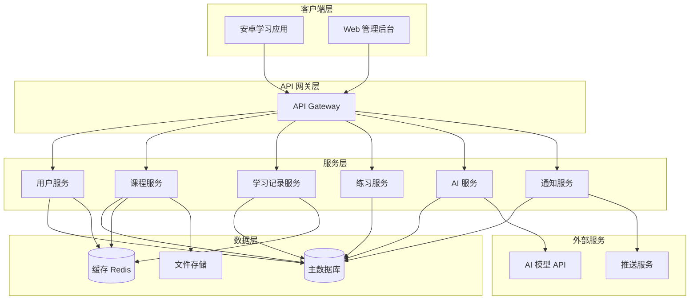
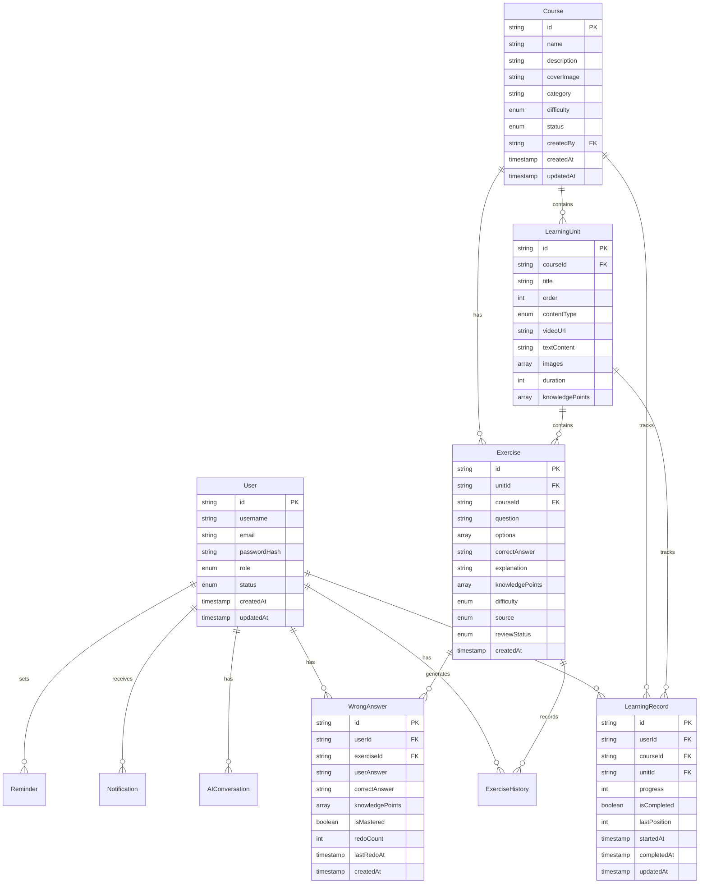

# 设计文档

## 概述

本系统是一个基于安卓平台的智能学习应用，集成了 AI 技术提供个性化学习体验。系统采用客户端-服务器架构，包含三个主要部分：

1. **安卓学习应用** - 学生端移动应用，提供课程学习、练习、AI 答疑等功能
2. **后端 API 服务** - 提供数据存储、业务逻辑和 AI 服务集成
3. **Web 管理后台** - 管理员使用的课程管理、用户管理和数据分析平台

系统的核心价值在于通过 AI 技术实现：
- 智能答疑，即时解决学习疑问
- 自动错题收集和分析
- 个性化练习题生成
- 学习数据分析和建议

## 架构

### 系统架构图



### 技术栈

**安卓应用:**
- Kotlin
- Jetpack Compose (UI)
- Room (本地数据库)
- Retrofit (网络请求)
- Coroutines (异步处理)
- ExoPlayer (视频播放)

**后端服务:**
- Spring Boot (Java/Kotlin)
- PostgreSQL (主数据库)
- Redis (缓存)
- MinIO/S3 (文件存储)
- RabbitMQ (消息队列)

**Web 管理后台:**
- React
- TypeScript
- Ant Design

**AI 服务:**
- OpenAI API / 自建大模型
- LangChain (AI 应用框架)

## 组件和接口

### 安卓应用组件

#### 1. UI 层
- **CourseListScreen**: 课程列表界面
- **CourseDetailScreen**: 课程详情界面
- **LearningScreen**: 学习内容展示界面
- **ExerciseScreen**: 练习答题界面
- **AIAssistantScreen**: AI 答疑对话界面
- **WrongAnswerBankScreen**: 错题库界面
- **LearningRecordScreen**: 学习记录界面
- **ProfileScreen**: 个人中心界面

#### 2. ViewModel 层
- **CourseViewModel**: 管理课程数据和状态
- **LearningViewModel**: 管理学习进度和内容
- **ExerciseViewModel**: 管理练习逻辑和评分
- **AIViewModel**: 管理 AI 对话状态
- **WrongAnswerViewModel**: 管理错题数据
- **UserViewModel**: 管理用户信息和设置

#### 3. Repository 层
- **CourseRepository**: 课程数据访问
- **LearningRecordRepository**: 学习记录数据访问
- **ExerciseRepository**: 练习数据访问
- **AIRepository**: AI 服务调用
- **UserRepository**: 用户数据访问

#### 4. 本地数据库 (Room)
- **CourseDao**: 课程数据操作
- **LearningRecordDao**: 学习记录操作
- **ExerciseDao**: 练习数据操作
- **WrongAnswerDao**: 错题数据操作

#### 5. 网络层
- **ApiService**: 定义所有 API 接口
- **NetworkModule**: 网络配置和依赖注入

### 后端服务组件

#### 1. 用户服务 (User Service)
```kotlin
interface UserService {
    fun register(username: String, password: String, email: String): User
    fun login(username: String, password: String): AuthToken
    fun getUserProfile(userId: String): UserProfile
    fun updateUserProfile(userId: String, profile: UserProfile): UserProfile
    fun resetPassword(userId: String, newPassword: String): Boolean
}
```

#### 2. 课程服务 (Course Service)
```kotlin
interface CourseService {
    fun getCourseList(category: String?, page: Int, size: Int): Page<Course>
    fun getCourseDetail(courseId: String): CourseDetail
    fun getLearningUnits(courseId: String): List<LearningUnit>
    fun downloadCourse(courseId: String, userId: String): DownloadInfo
    fun createCourse(course: Course): Course
    fun updateCourse(courseId: String, course: Course): Course
    fun publishCourse(courseId: String): Boolean
}
```

#### 3. 学习记录服务 (Learning Record Service)
```kotlin
interface LearningRecordService {
    fun saveLearningProgress(userId: String, unitId: String, progress: Int): LearningRecord
    fun getLearningRecords(userId: String, courseId: String): List<LearningRecord>
    fun getOverallProgress(userId: String): Map<String, Double>
    fun markUnitComplete(userId: String, unitId: String): Boolean
}
```

#### 4. 练习服务 (Exercise Service)
```kotlin
interface ExerciseService {
    fun getExercises(unitId: String): List<Exercise>
    fun submitAnswer(userId: String, exerciseId: String, answer: String): AnswerResult
    fun getExerciseHistory(userId: String, courseId: String): List<ExerciseHistory>
    fun createExercise(exercise: Exercise): Exercise
}
```

#### 5. AI 服务 (AI Service)
```kotlin
interface AIService {
    fun askQuestion(userId: String, question: String, context: LearningContext): AIResponse
    fun analyzeWrongAnswers(userId: String): WrongAnswerAnalysis
    fun generateExercises(userId: String, knowledgePoints: List<String>, count: Int): List<Exercise>
    fun generateLearningReport(userId: String, timeRange: TimeRange): LearningReport
    fun reviewAIContent(contentId: String, approved: Boolean, feedback: String?): Boolean
}
```

#### 6. 通知服务 (Notification Service)
```kotlin
interface NotificationService {
    fun sendNotification(userId: String, notification: Notification): Boolean
    fun scheduleReminder(userId: String, reminder: Reminder): Boolean
    fun getNotificationHistory(userId: String): List<Notification>
    fun createSystemNotification(notification: SystemNotification, targetUsers: List<String>): Boolean
}
```

### API 接口设计

#### 学生端 API

**课程相关:**
- `GET /api/courses` - 获取课程列表
- `GET /api/courses/{courseId}` - 获取课程详情
- `GET /api/courses/{courseId}/units` - 获取学习单元列表
- `POST /api/courses/{courseId}/download` - 下载课程

**学习记录:**
- `POST /api/learning/progress` - 保存学习进度
- `GET /api/learning/records` - 获取学习记录
- `POST /api/learning/units/{unitId}/complete` - 标记单元完成

**练习:**
- `GET /api/exercises/unit/{unitId}` - 获取练习题
- `POST /api/exercises/submit` - 提交答案
- `GET /api/exercises/history` - 获取练习历史

**AI 功能:**
- `POST /api/ai/ask` - AI 答疑
- `GET /api/ai/wrong-answers/analysis` - 错题分析
- `POST /api/ai/exercises/generate` - 生成个性化练习
- `GET /api/ai/learning-report` - 获取学习报告

**错题库:**
- `GET /api/wrong-answers` - 获取错题列表
- `GET /api/wrong-answers/{id}` - 获取错题详情
- `POST /api/wrong-answers/{id}/redo` - 重做错题
- `PUT /api/wrong-answers/{id}/master` - 标记已掌握

#### 管理端 API

**课程管理:**
- `POST /api/admin/courses` - 创建课程
- `PUT /api/admin/courses/{courseId}` - 更新课程
- `POST /api/admin/courses/{courseId}/publish` - 发布课程
- `POST /api/admin/courses/{courseId}/units` - 添加学习单元
- `POST /api/admin/exercises` - 创建练习题

**用户管理:**
- `GET /api/admin/users` - 获取用户列表
- `GET /api/admin/users/{userId}` - 获取用户详情
- `PUT /api/admin/users/{userId}/status` - 更新用户状态
- `POST /api/admin/users/{userId}/reset-password` - 重置密码

**数据分析:**
- `GET /api/admin/analytics/overview` - 获取总览数据
- `GET /api/admin/analytics/courses` - 获取课程数据
- `GET /api/admin/analytics/knowledge-points` - 获取知识点分析
- `POST /api/admin/analytics/export` - 导出报告

**AI 管理:**
- `GET /api/admin/ai/pending-review` - 获取待审核内容
- `POST /api/admin/ai/review` - 审核内容
- `GET /api/admin/ai/config` - 获取 AI 配置
- `PUT /api/admin/ai/config` - 更新 AI 配置

**通知管理:**
- `POST /api/admin/notifications` - 创建通知
- `GET /api/admin/notifications/history` - 获取通知历史
- `POST /api/admin/notifications/schedule` - 设置定时通知

## 数据模型

### 核心实体

#### User (用户)
```kotlin
data class User(
    val id: String,
    val username: String,
    val email: String,
    val passwordHash: String,
    val role: UserRole, // STUDENT, ADMIN
    val status: UserStatus, // ACTIVE, DISABLED
    val createdAt: Timestamp,
    val updatedAt: Timestamp
)

data class UserProfile(
    val userId: String,
    val nickname: String?,
    val avatar: String?,
    val grade: String?,
    val preferences: Map<String, Any>
)
```

#### Course (课程)
```kotlin
data class Course(
    val id: String,
    val name: String,
    val description: String,
    val coverImage: String,
    val category: String,
    val difficulty: DifficultyLevel, // BEGINNER, INTERMEDIATE, ADVANCED
    val status: CourseStatus, // DRAFT, PUBLISHED, ARCHIVED
    val createdBy: String,
    val createdAt: Timestamp,
    val updatedAt: Timestamp
)

data class LearningUnit(
    val id: String,
    val courseId: String,
    val title: String,
    val order: Int,
    val contentType: ContentType, // VIDEO, TEXT, IMAGE, MIXED
    val videoUrl: String?,
    val textContent: String?,
    val images: List<String>,
    val duration: Int?, // 分钟
    val knowledgePoints: List<String>
)
```

#### Exercise (练习题)
```kotlin
data class Exercise(
    val id: String,
    val unitId: String?,
    val courseId: String,
    val question: String,
    val options: List<String>,
    val correctAnswer: String,
    val explanation: String,
    val knowledgePoints: List<String>,
    val difficulty: DifficultyLevel,
    val source: ExerciseSource, // MANUAL, AI_GENERATED
    val reviewStatus: ReviewStatus?, // PENDING, APPROVED, REJECTED
    val createdAt: Timestamp
)

data class AnswerResult(
    val exerciseId: String,
    val isCorrect: Boolean,
    val correctAnswer: String,
    val explanation: String,
    val userAnswer: String
)
```

#### LearningRecord (学习记录)
```kotlin
data class LearningRecord(
    val id: String,
    val userId: String,
    val courseId: String,
    val unitId: String,
    val progress: Int, // 0-100
    val isCompleted: Boolean,
    val lastPosition: Int?, // 视频播放位置（秒）
    val startedAt: Timestamp,
    val completedAt: Timestamp?,
    val updatedAt: Timestamp
)

data class ExerciseHistory(
    val id: String,
    val userId: String,
    val exerciseId: String,
    val userAnswer: String,
    val isCorrect: Boolean,
    val attemptCount: Int,
    val submittedAt: Timestamp
)
```

#### WrongAnswer (错题)
```kotlin
data class WrongAnswer(
    val id: String,
    val userId: String,
    val exerciseId: String,
    val exercise: Exercise,
    val userAnswer: String,
    val correctAnswer: String,
    val knowledgePoints: List<String>,
    val isMastered: Boolean,
    val redoCount: Int,
    val lastRedoAt: Timestamp?,
    val createdAt: Timestamp
)

data class WrongAnswerAnalysis(
    val userId: String,
    val totalWrongCount: Int,
    val weakKnowledgePoints: List<KnowledgePointStat>,
    val suggestions: List<String>
)

data class KnowledgePointStat(
    val knowledgePoint: String,
    val wrongCount: Int,
    val totalCount: Int,
    val masteryRate: Double
)
```

#### AIConversation (AI 对话)
```kotlin
data class AIConversation(
    val id: String,
    val userId: String,
    val messages: List<AIMessage>,
    val context: LearningContext?,
    val createdAt: Timestamp,
    val updatedAt: Timestamp
)

data class AIMessage(
    val role: MessageRole, // USER, ASSISTANT
    val content: String,
    val timestamp: Timestamp
)

data class LearningContext(
    val courseId: String?,
    val unitId: String?,
    val knowledgePoints: List<String>
)

data class AIResponse(
    val answer: String,
    val relatedKnowledgePoints: List<String>,
    val suggestedUnits: List<String>
)
```

#### LearningReport (学习报告)
```kotlin
data class LearningReport(
    val userId: String,
    val timeRange: TimeRange,
    val totalLearningTime: Int, // 分钟
    val completedCourses: Int,
    val completedUnits: Int,
    val exerciseStats: ExerciseStats,
    val knowledgePointMastery: Map<String, Double>,
    val weakPoints: List<String>,
    val suggestions: List<String>,
    val generatedAt: Timestamp
)

data class ExerciseStats(
    val totalExercises: Int,
    val correctCount: Int,
    val accuracy: Double,
    val averageAttempts: Double
)
```

#### Notification (通知)
```kotlin
data class Notification(
    val id: String,
    val userId: String,
    val title: String,
    val content: String,
    val type: NotificationType, // SYSTEM, REMINDER, ACHIEVEMENT
    val isRead: Boolean,
    val createdAt: Timestamp
)

data class Reminder(
    val id: String,
    val userId: String,
    val time: String, // HH:mm 格式
    val daysOfWeek: List<DayOfWeek>,
    val isEnabled: Boolean,
    val message: String
)

data class SystemNotification(
    val id: String,
    val title: String,
    val content: String,
    val targetUserIds: List<String>,
    val scheduledAt: Timestamp?,
    val sentAt: Timestamp?,
    val deliveryRate: Double?,
    val readRate: Double?
)
```

### 数据库关系




## 正确性属性

*属性是关于系统行为的特征，应该在所有有效执行中保持为真——本质上是关于系统应该做什么的形式化陈述。属性是人类可读规范和机器可验证正确性保证之间的桥梁。*

### 属性 1: 课程列表数据完整性
*对于任意*课程列表查询，返回的每个课程对象都应该包含名称、描述和封面图片字段
**验证需求: 1.1**

### 属性 2: 课程详情查询一致性
*对于任意*有效的课程ID，查询课程详情应该返回包含详细信息和学习单元列表的完整数据
**验证需求: 1.2**

### 属性 3: 学习列表添加幂等性
*对于任意*用户和课程，将课程添加到学习列表后，该课程应该出现在用户的学习列表中
**验证需求: 1.3**

### 属性 4: 学习内容顺序性
*对于任意*学习单元列表，返回的内容应该按照order字段升序排列
**验证需求: 2.1**

### 属性 5: 单元完成状态传播
*对于任意*学习单元，标记为完成后，该单元的isCompleted应该为true，且下一个单元应该变为可访问状态
**验证需求: 2.3**

### 属性 6: 学习进度往返一致性
*对于任意*学习进度数据，保存到本地存储后再读取，应该得到相同的进度值
**验证需求: 2.4, 2.5**

### 属性 7: 练习题数据完整性
*对于任意*练习题，应该包含题目内容(question)和答题选项(options)字段
**验证需求: 3.1**

### 属性 8: 答案判断正确性
*对于任意*练习题和提交的答案，当答案等于correctAnswer时判断结果应该为正确，否则为错误
**验证需求: 3.2**

### 属性 9: 正确答题统计递增性
*对于任意*答题记录，提交正确答案后，正确答题计数应该比之前增加1
**验证需求: 3.3**

### 属性 10: 错误答案反馈完整性
*对于任意*错误答案提交，返回结果应该包含正确答案(correctAnswer)和解析(explanation)字段
**验证需求: 3.4**

### 属性 11: 正确率计算准确性
*对于任意*答题记录集合，正确率应该等于正确答题数除以总答题数
**验证需求: 3.5**

### 属性 12: 课程完成度计算准确性
*对于任意*用户的学习记录，课程完成百分比应该等于已完成单元数除以总单元数乘以100
**验证需求: 4.1**

### 属性 13: 学习记录数据完整性
*对于任意*课程的详细学习记录，应该包含每个学习单元的完成状态和对应的练习成绩
**验证需求: 4.2**

### 属性 14: 练习历史数据完整性
*对于任意*练习历史记录，每条记录应该包含日期(submittedAt)、题目数量和正确率字段
**验证需求: 4.3**

### 属性 15: 学习记录持久化往返性
*对于任意*学习记录更新，保存到本地存储后再查询，应该得到更新后的数据
**验证需求: 4.4**

### 属性 16: 收藏列表添加一致性
*对于任意*学习内容，点击收藏后，该内容应该出现在收藏列表中
**验证需求: 5.1**

### 属性 17: 收藏项数据完整性
*对于任意*收藏项，应该包含来源课程ID(courseId)和单元ID(unitId)信息
**验证需求: 5.2**

### 属性 18: 取消收藏移除一致性
*对于任意*已收藏内容，取消收藏后，该内容不应该出现在收藏列表中
**验证需求: 5.4**

### 属性 19: 提醒配置往返一致性
*对于任意*提醒配置，保存到本地存储后再读取，应该得到相同的配置数据
**验证需求: 6.1**

### 属性 20: 提醒取消清空性
*对于任意*用户，关闭学习提醒后，该用户的提醒列表应该为空或所有提醒的isEnabled应该为false
**验证需求: 6.4**

### 属性 21: 课程下载本地可访问性
*对于任意*已下载的课程，应该能从本地存储中读取完整的课程数据和媒体文件路径
**验证需求: 7.1**

### 属性 22: 离线已下载内容可访问性
*对于任意*已下载课程，在离线状态下访问应该成功返回内容
**验证需求: 7.2**

### 属性 23: 离线未下载内容错误提示
*对于任意*未下载课程，在离线状态下访问应该返回需要网络连接的错误信息
**验证需求: 7.3**

### 属性 24: 离线学习数据本地记录性
*对于任意*离线状态下的学习操作，学习进度和练习结果应该保存到本地数据库
**验证需求: 7.4**

### 属性 25: AI问题请求发送完整性
*对于任意*用户问题，发送到AI服务的请求应该包含问题内容(question)字段
**验证需求: 8.2**

### 属性 26: AI响应数据完整性
*对于任意*AI服务返回，响应应该包含答案内容(answer)字段
**验证需求: 8.3**

### 属性 27: AI上下文传递完整性
*对于任意*带上下文的AI提问，请求应该包含当前课程ID(courseId)和知识点(knowledgePoints)信息
**验证需求: 8.5**

### 属性 28: 错题自动收集一致性
*对于任意*答错的练习题，该题目应该自动添加到用户的错题库中
**验证需求: 9.1**

### 属性 29: 错题数据完整性
*对于任意*错题记录，应该包含题目内容、正确答案(correctAnswer)、学生答案(userAnswer)和相关知识点(knowledgePoints)字段
**验证需求: 9.2**

### 属性 30: 错题详情数据完整性
*对于任意*错题，查询详情应该返回详细解析(explanation)和相关知识点链接
**验证需求: 9.3**

### 属性 31: 错题重做题目一致性
*对于任意*错题，选择重做时返回的题目ID应该与原错题的exerciseId相同
**验证需求: 9.4**

### 属性 32: 错题掌握状态更新性
*对于任意*错题，重做并答对后，该错题的isMastered字段应该更新为true
**验证需求: 9.5**

### 属性 33: 错题知识点分类准确性
*对于任意*错题集合，按知识点分类后，每个分类中的错题都应该包含该知识点
**验证需求: 9.6**

### 属性 34: 薄弱知识点识别准确性
*对于任意*错题库，识别出的薄弱知识点应该是错误率最高的知识点集合
**验证需求: 10.1**

### 属性 35: AI练习生成请求完整性
*对于任意*练习生成请求，发送到AI服务的请求应该包含识别出的薄弱知识点列表
**验证需求: 10.2**

### 属性 36: AI生成练习保存一致性
*对于任意*AI返回的练习题集合，所有题目都应该被保存到个性化练习集中
**验证需求: 10.3**

### 属性 37: 知识点掌握度更新性
*对于任意*完成的AI生成练习，相关知识点的掌握度评估应该根据答题结果更新
**验证需求: 10.4**

### 属性 38: 持续答错推荐触发性
*对于任意*知识点，当错误次数超过阈值时，应该生成相关学习单元的推荐列表
**验证需求: 10.5**

### 属性 39: 学习报告生成完整性
*对于任意*用户的学习记录，生成的报告应该能成功返回
**验证需求: 11.1**

### 属性 40: 学习报告数据完整性
*对于任意*学习报告，应该包含学习时长(totalLearningTime)、知识点掌握情况(knowledgePointMastery)和薄弱环节(weakPoints)字段
**验证需求: 11.2**

### 属性 41: 学习建议包含性
*对于任意*学习报告，应该包含非空的建议列表(suggestions)
**验证需求: 11.3**

### 属性 42: 优秀表现推荐高难度性
*对于任意*在某科目正确率超过90%的用户，推荐的学习内容难度(difficulty)应该高于当前学习内容
**验证需求: 11.5**

### 属性 43: 管理员认证有效性
*对于任意*有效的管理员凭证，登录应该成功并返回认证令牌
**验证需求: 12.1**

### 属性 44: 课程创建数据完整性
*对于任意*新创建的课程，应该包含名称(name)、描述(description)、封面图片(coverImage)和分类(category)字段
**验证需求: 12.2**

### 属性 45: 学习单元创建数据完整性
*对于任意*新创建的学习单元，应该包含标题(title)、顺序(order)和内容类型(contentType)字段
**验证需求: 12.3**

### 属性 46: 练习题创建数据完整性
*对于任意*新创建的练习题，应该包含题目(question)、选项(options)、正确答案(correctAnswer)、解析(explanation)和知识点(knowledgePoints)字段
**验证需求: 12.4**

### 属性 47: 课程发布状态更新性
*对于任意*课程，执行发布操作后，课程状态(status)应该更新为PUBLISHED
**验证需求: 12.5**

### 属性 48: 课程编辑更新一致性
*对于任意*已发布课程，编辑后再查询应该得到更新后的内容
**验证需求: 12.6**

### 属性 49: 用户列表数据完整性
*对于任意*用户列表查询，返回的每个用户应该包含基本信息和账户状态(status)字段
**验证需求: 13.1**

### 属性 50: 用户搜索结果匹配性
*对于任意*搜索查询，返回的所有用户的用户名、邮箱或手机号应该包含搜索关键词
**验证需求: 13.2**

### 属性 51: 用户详情数据完整性
*对于任意*用户ID，查询详情应该返回学习记录、练习成绩和活跃度数据
**验证需求: 13.3**

### 属性 52: 账户禁用登录阻止性
*对于任意*被禁用的用户账户，登录尝试应该失败并返回账户已禁用的错误
**验证需求: 13.4**

### 属性 53: 密码重置生成性
*对于任意*密码重置请求，应该生成新的临时密码并更新用户的passwordHash
**验证需求: 13.5**

### 属性 54: 统计数据计算准确性
*对于任意*时间范围，返回的用户活跃度、课程完成率和练习正确率统计应该基于该时间范围内的实际数据计算
**验证需求: 14.1**

### 属性 55: 时间过滤数据范围性
*对于任意*选择的时间范围，返回的统计数据应该只包含该时间范围内的记录
**验证需求: 14.2**

### 属性 56: 课程统计数据完整性
*对于任意*课程，统计数据应该包含学习人数、完成率和平均成绩字段
**验证需求: 14.3**

### 属性 57: 知识点统计分组准确性
*对于任意*知识点分析，每个知识点的统计应该只包含标记了该知识点的练习题数据
**验证需求: 14.4**

### 属性 58: 报告导出数据包含性
*对于任意*导出请求，生成的文件应该包含当前页面显示的所有统计数据
**验证需求: 14.5**

### 属性 59: AI生成内容待审核状态
*对于任意*AI生成的练习题，初始的reviewStatus应该为PENDING
**验证需求: 15.1**

### 属性 60: 待审核列表过滤准确性
*对于任意*待审核内容查询，返回的所有内容的reviewStatus都应该为PENDING
**验证需求: 15.2**

### 属性 61: 内容审核状态更新性
*对于任意*审核操作，内容的reviewStatus应该根据审核结果更新为APPROVED或REJECTED
**验证需求: 15.3**

### 属性 62: 内容批准状态更新性
*对于任意*批准操作，内容的reviewStatus应该更新为APPROVED
**验证需求: 15.4**

### 属性 63: 内容拒绝原因记录性
*对于任意*拒绝操作，应该记录拒绝原因(feedback)字段
**验证需求: 15.5**

### 属性 64: AI配置查询返回性
*对于任意*AI配置查询，应该返回当前的配置参数
**验证需求: 16.1**

### 属性 65: AI配置更新往返性
*对于任意*AI配置更新，保存后再查询应该得到更新后的配置
**验证需求: 16.2**

### 属性 66: AI模板应用一致性
*对于任意*答疑响应模板设置，后续AI回答的格式应该符合该模板
**验证需求: 16.3**

### 属性 67: 题目难度分布符合性
*对于任意*难度参数设置，AI生成的练习题难度分布应该符合设置的比例
**验证需求: 16.4**

### 属性 68: 通知创建数据完整性
*对于任意*新创建的通知，应该包含标题(title)、内容(content)和目标用户(targetUserIds)字段
**验证需求: 17.1**

### 属性 69: 通知发送接收一致性
*对于任意*发送的通知，所有目标用户都应该能在其通知列表中查询到该通知
**验证需求: 17.2**

### 属性 70: 通知历史统计完整性
*对于任意*通知历史记录，应该包含送达率(deliveryRate)和阅读率(readRate)统计字段
**验证需求: 17.3**

### 属性 71: 用户通知接收可见性
*对于任意*发送给用户的通知，该用户的通知列表应该包含该通知
**验证需求: 17.5**

## 错误处理

### 网络错误处理

**连接超时:**
- 设置合理的超时时间（连接超时: 10秒，读取超时: 30秒）
- 超时后显示友好的错误提示
- 提供重试选项

**网络不可用:**
- 检测网络状态
- 离线时自动切换到本地数据
- 显示离线模式指示器

**API错误响应:**
- 统一的错误响应格式:
```kotlin
data class ApiError(
    val code: String,
    val message: String,
    val details: Map<String, Any>?
)
```
- 根据错误码显示对应的用户友好消息
- 记录详细错误日志用于调试

### 数据验证错误

**输入验证:**
- 客户端进行基本验证（非空、格式、长度）
- 服务端进行完整验证
- 返回具体的验证错误信息

**数据完整性:**
- 使用数据库约束确保数据完整性
- 事务处理确保操作原子性
- 定期数据一致性检查

### AI服务错误处理

**AI服务不可用:**
- 实现降级策略，使用缓存的响应或预设回答
- 显示服务暂时不可用的提示
- 记录错误并告警

**AI响应质量问题:**
- 实现内容过滤和安全检查
- 对不合适的回答进行拦截
- 提供人工审核机制

**AI响应超时:**
- 设置较长的超时时间（60秒）
- 显示加载进度
- 允许用户取消请求

### 存储错误处理

**本地存储空间不足:**
- 检查可用空间
- 提示用户清理空间或删除已下载内容
- 实现智能缓存清理策略

**数据库错误:**
- 捕获并记录所有数据库异常
- 实现数据库迁移和修复机制
- 定期备份重要数据

### 用户体验优化

**加载状态:**
- 所有异步操作显示加载指示器
- 长时间操作显示进度百分比
- 提供取消操作的选项

**错误恢复:**
- 自动重试机制（最多3次）
- 保存用户输入，错误后可恢复
- 提供明确的错误恢复指引

## 测试策略

### 单元测试

**测试范围:**
- 所有业务逻辑函数
- 数据模型的验证逻辑
- 工具类和辅助函数
- Repository层的数据访问逻辑

**测试框架:**
- JUnit 5 (后端)
- Kotest (Kotlin)
- MockK (Kotlin mocking)
- Jest (Web前端)

**测试原则:**
- 每个公共函数至少一个测试
- 测试正常流程和边界情况
- 使用有意义的测试名称
- 保持测试独立性

### 属性测试

**测试框架:**
- Kotest Property Testing (Kotlin/Android)
- fast-check (TypeScript/Web)

**配置:**
- 每个属性测试运行至少100次迭代
- 使用智能生成器约束输入空间

**测试标注:**
- 每个属性测试必须包含注释，格式为: `// Feature: learning-app, Property X: [属性描述]`
- 每个属性测试必须标注验证的需求: `// Validates: Requirements X.Y`

**属性测试覆盖:**
- 数据往返属性（序列化/反序列化、存储/读取）
- 不变量属性（列表操作后的数据完整性）
- 幂等性属性（重复操作结果一致）
- 关系属性（操作前后的数据关系）

**生成器设计:**
- 为每个数据模型创建智能生成器
- 生成器应该生成有效和边界值
- 考虑业务规则约束

示例:
```kotlin
// Feature: learning-app, Property 6: 学习进度往返一致性
// Validates: Requirements 2.4, 2.5
class LearningRecordPropertyTest : StringSpec({
    "saving and loading learning progress should return same data" {
        checkAll(100, Arb.learningRecord()) { record ->
            val repository = LearningRecordRepository()
            repository.save(record)
            val loaded = repository.load(record.userId, record.unitId)
            loaded shouldBe record
        }
    }
})
```

### 集成测试

**测试范围:**
- API端点测试
- 数据库集成测试
- 外部服务集成（AI服务、推送服务）

**测试环境:**
- 使用测试数据库
- Mock外部服务
- 隔离的测试环境

### UI测试

**安卓UI测试:**
- Espresso (UI交互测试)
- Compose Testing (Jetpack Compose组件测试)

**Web UI测试:**
- React Testing Library
- Cypress (E2E测试)

**测试重点:**
- 关键用户流程
- 表单验证
- 导航流程
- 错误状态显示

### 性能测试

**测试指标:**
- API响应时间 < 500ms (90th percentile)
- 页面加载时间 < 2秒
- 数据库查询时间 < 100ms
- AI响应时间 < 10秒

**测试工具:**
- JMeter (负载测试)
- Android Profiler (性能分析)
- Chrome DevTools (Web性能)

### AI功能测试

**测试策略:**
- 使用固定的测试问题集
- 验证响应格式和必需字段
- 检查响应时间
- 内容安全性检查

**质量评估:**
- 人工评审AI生成内容样本
- 收集用户反馈
- 监控AI服务错误率

### 测试自动化

**CI/CD集成:**
- 每次提交运行单元测试和属性测试
- 每日运行完整的集成测试
- 发布前运行完整的测试套件

**测试覆盖率目标:**
- 单元测试覆盖率 > 80%
- 属性测试覆盖所有定义的正确性属性
- 关键业务流程100%覆盖

### 测试数据管理

**测试数据生成:**
- 使用工厂模式创建测试数据
- 属性测试使用随机生成器
- 保持测试数据的真实性

**测试数据清理:**
- 每个测试后清理数据
- 使用事务回滚
- 独立的测试数据库

## 安全考虑

### 认证和授权

**用户认证:**
- JWT令牌认证
- 令牌过期时间: 7天
- 刷新令牌机制

**密码安全:**
- BCrypt哈希算法
- 密码强度要求（最少8位，包含字母和数字）
- 密码重置通过邮箱验证

**权限控制:**
- 基于角色的访问控制（RBAC）
- 学生只能访问自己的数据
- 管理员权限分级

### 数据安全

**数据加密:**
- HTTPS传输加密
- 敏感数据字段加密存储
- 本地数据库加密（SQLCipher）

**数据隐私:**
- 遵循GDPR和数据保护法规
- 用户数据最小化收集
- 提供数据导出和删除功能

### API安全

**请求验证:**
- 所有请求验证JWT令牌
- 请求参数验证和清理
- 防止SQL注入和XSS攻击

**速率限制:**
- API调用频率限制
- 防止暴力破解
- DDoS防护

### AI安全

**内容安全:**
- AI响应内容过滤
- 敏感词检测
- 不当内容拦截

**提示注入防护:**
- 用户输入清理
- 限制提示长度
- 监控异常请求模式

## 部署架构

### 服务器部署

**应用服务器:**
- 容器化部署（Docker）
- Kubernetes编排
- 自动扩缩容

**数据库:**
- PostgreSQL主从复制
- 定期备份
- 读写分离

**缓存:**
- Redis集群
- 缓存预热
- 缓存失效策略

### 监控和日志

**应用监控:**
- 健康检查端点
- 性能指标收集
- 错误率监控

**日志管理:**
- 结构化日志
- 集中式日志收集
- 日志分析和告警

### 灾难恢复

**备份策略:**
- 数据库每日全量备份
- 增量备份每小时
- 备份数据异地存储

**恢复计划:**
- RTO (恢复时间目标): 4小时
- RPO (恢复点目标): 1小时
- 定期恢复演练
